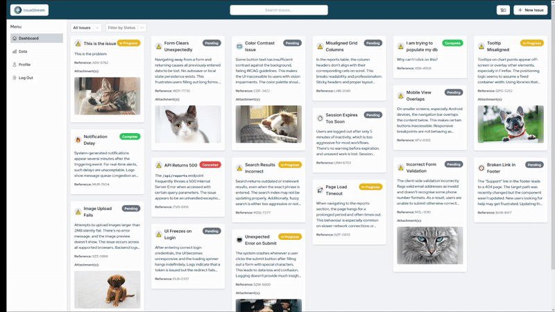
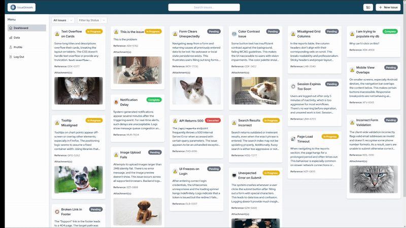
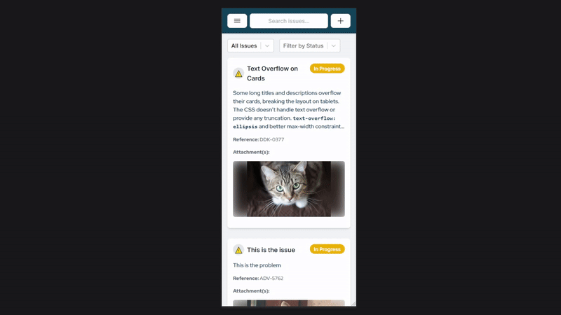
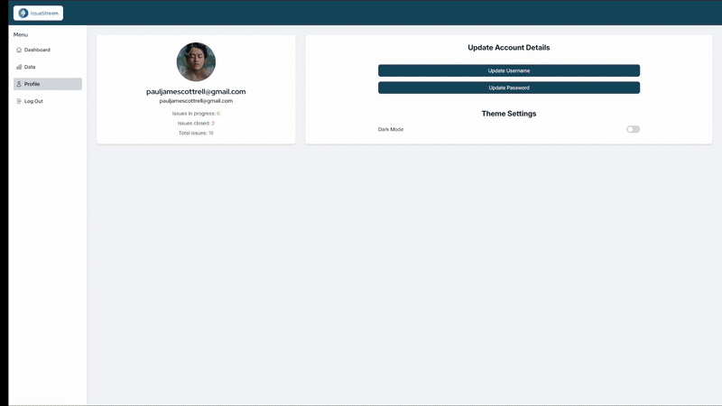

# Intermittent Issue Tracker

## 📚 Table of Contents

- [Summary](#track-and-manage-intermittent-issues-with-ease)
- [Feature Previews](#-feature-previews)
- [Technologies Used](#technologies-used)
- [Installation](#installation)
  - [1. Clone the repository](#1-clone-the-repository)
  - [2. Set up the backend](#2-set-up-the-backend)
  - [3. Set up the frontend](#3-set-up-the-frontend)
  - [Application URLs](#application-urls)
- [Usage](#usage)
- [Database Documentation](#database-documentation)
- [API Documentation](#api-documentation)
- [Contributing](#contributing)
- [License](#license)

## Track and Manage Intermittent Issues with Ease

The Intermittent Issue Tracker is a mobile-compatible web application designed to help users keep track of recurring issues. Whether it's a technical glitch, a health symptom, or any other type of intermittent problem, this tool enables you to log instances, track patterns, and gain insights over time.


The Intermittent Issue Tracker allows users to:

- **Log Issues:** Quickly add new issues you wish to monitor, with a charm icon for easy visual reference.
- **Track Occurrences:** Record and timestamp each instance of an issue and view a chronological history of logged occurrences.
- **Visualise Data:** Generate dynamic charts and graphs to analyse how frequently issues arise and identify trends over time.
- **User Profiles:** Manage your personal data, update your username or password, and adjust notification settings all from a clean, intuitive profile interface.
- **Authentication:** Secure JWT-based login and registration system protects user data and ensures access control for all operations.
- **Attachments:** Upload and preview supporting images or documents with each issue or occurrence using a drag-and-drop interface.
- **Comments:** Leave comments or updates on any issue to create a living history of discussions, thoughts, or progress.

---

✨ The Intermittent Issue Tracker is also:

- **Fully Responsive:** Optimised for desktop, tablet, and mobile experiences using Tailwind CSS utility classes and custom breakpoints.
- **Dark Mode Friendly:** Adapts to user preference with a polished dark theme that enhances readability and visual comfort.
- **User-Friendly:** Clean and minimal interface with logical navigation ensures a smooth and distraction-free user experience.
- **Accessible:** Designed with accessibility best practices in mind, including semantic HTML, focus states, and keyboard navigation support.

---

## 🎬 Feature Previews

Below are short previews demonstrating key features of the Intermittent Issue Tracker in action. From logging new issues to searching and interacting with a fully responsive interface, these clips showcase the app’s smooth, user-friendly workflow across different devices.

- 📝 **Adding a New Issue** – Create a new issue with charm selection, rich text description, and optional attachments.

- 🔍 **Searching for Issues** – Instantly filter your issue list by keyword with real-time search.

- 📐 **Adaptive Layout** – The interface layout can be adjusted to user preference

- 📱 **Mobile Responsiveness** – Optimised for use on smartphones and tablets.

- 🌒 **Dark/Light Theme Support** – Seamlessly switches based on user preference.


---


## Technologies Used

- **Frontend:** Built using , , ,  and .
- **Backend:** Powered by , .
- **Database:**  with Mongoose for data management.
- **Data Visualisation:**  for creating dynamic data visualisations.
- **Authentication**:  for secure user authentication.

---


## Installation

To get started with the **Intermittent Issue Tracker** on your local machine, follow the steps below.

### 1. Clone the repository

```bash
git clone https://github.com/p-cottrell/issue-tracker
cd issue-tracker
```

---

### 2. Set up the backend

```bash
cd backend
npm install
```

Create a `.env` file inside the `backend/` folder with the following variables:

```env
PORT=5000
NODE_ENV=development
MONGO_URI=your_mongodb_connection_string
ACCESS_TOKEN_SECRET=your_jwt_secret_key
AWS_ACCESS_KEY_ID=your_aws_access_key
AWS_SECRET_ACCESS_KEY=your_aws_secret_key
AWS_REGION=ap-southeast-2
S3_BUCKET_NAME=your_bucket_name
```

> ⚠️ Make sure you **do not commit** this file or Jeff Bezos will take all of your money. Add `.env` to your `.gitignore`.

Start the backend server:

```bash
npm start
```

---

### 3. Set up the frontend

In a new terminal window:

```bash
cd ../frontend
npm install
```

Start the frontend development server:

```bash
npm start
```

---

### Application URLs

Once both servers are running:

- **Frontend**: [http://localhost:5173](http://localhost:5173)
- **Backend API**: [http://localhost:5000](http://localhost:5000)

---

## Usage

1. **Register an account** to start tracking your issues.
2. **Log in** to access your personal dashboard.
3. **Click "Add Issue"** to begin logging a new recurring problem.
4. **Record each occurrence** of that issue over time.
5. **Use charts and stats** to gain insights about frequency and patterns.
6. **Manage files and comments** on each issue entry.

---

## Database Documentation

The MongoDB schema supports users, issues, attachments, comments, and status history.

For more details on the schema structure and relationships, refer to the [📚 Database README](https://github.com/p-cottrell/issue-tracker/blob/main/db/README.md).

---

## API Documentation

The backend provides RESTful endpoints for interacting with all resources.

Example routes:

- `POST /api/users/register` – Register a new user
- `POST /api/users/login` – Login and receive a token
- `GET /api/issues` – Get all issues for the authenticated user
- `POST /api/issues` – Create a new issue
- `PUT /api/issues/:id` – Update an existing issue
- `DELETE /api/issues/:id` – Delete an issue
- `POST /api/attachments/:issueId` – Upload image/file attachments

View the [🔌 Full API Documentation](https://github.com/p-cottrell/issue-tracker/blob/main/api_documentation/API_DOCUMENTATION.md) for all available endpoints and examples.

---

## Contributing

Contributions are welcome! To contribute:

```bash
git checkout -b feature/your-feature-name
```

- Commit your changes with a meaningful message
- Submit a pull request with a description of your changes

---

## License

This project is licensed under the MIT License. See the [LICENSE](https://github.com/p-cottrell/issue-tracker/blob/main/LICENSE) file for more details.

---